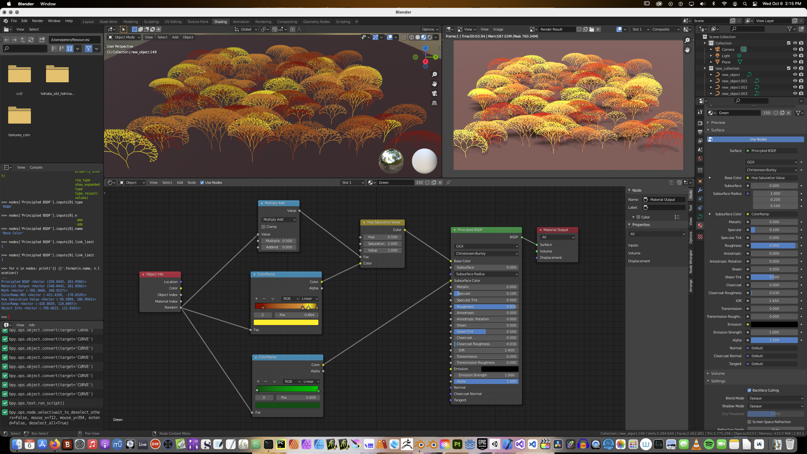
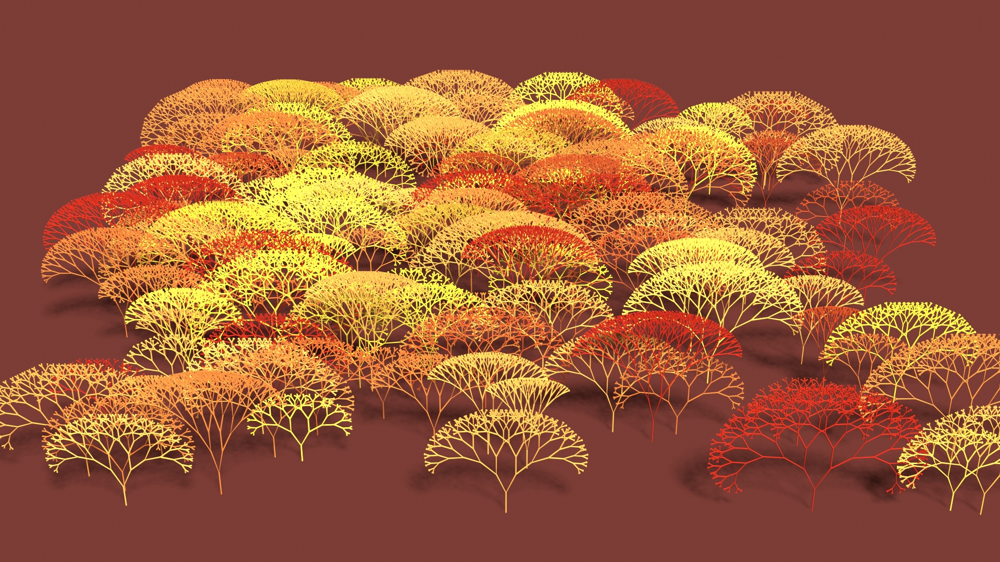
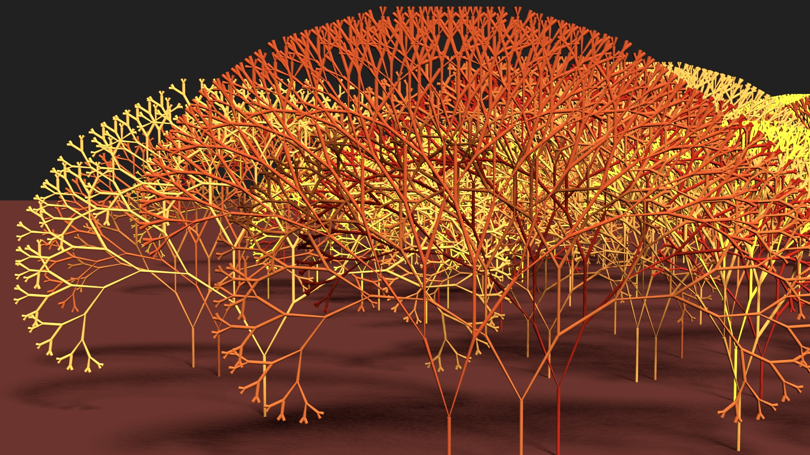

# Fractal Forest

This script was written in Python for Blender (version 2.93.1). It generates a set number of fractal trees, randomizing the location, size, angles, and coloring of each tree.

The trees follow a simple recursive branching method in the YZ plane consisting of vertices and edges. The resulting mesh is converted to a curve object, a bevel is added to provide volume, and a material is created to provide the color. The material for the trees uses nodes which are created, set up, and arranged by the script.

The script also generates a ground plane and a material to color it.

The script is hard-coded for the number of trees to generate and the bounds for the randomizations. These can be modified as needed before running the script.

After manually setting up a ground plane, light, and camera view, the output (using EVEE) is rendered.

Render with the camera closer.

